# Потоковая репликация

><u>Два хоста postprohost3 будет MASTER, postprohost4 будет первоначально как SLAVE.</u>

><u>Поскольку нет DNS, то добавим имена и адреса в ***/etc/hosts*** встречно </u>

><u>Входим в систему под пользователем postgres. Создаем нового пользователя для репликации.
createuser – создает нового пользователя Postgres система запросит пароль — его нужно придумать и ввести дважды. В данном примере мы создаем пользователя repluser.
Выходим из оболочки пользователя postgres.</u>

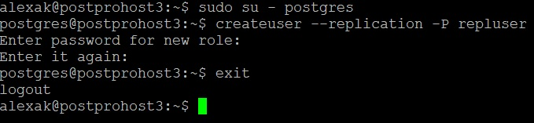

><u>Редактируем следующие параметры на MASTER. Сразу делает тоже самое на SLAVE, что бы потом плавно переключиться. Только на SLAVE ставим адрес 192.16.1.226</u>

listen_addresses = 'localhost, 192.168.1.225’

wal_level = replica

max_wal_senders = 10

max_replication_slots = 10

hot_standby = on

hot_standby_feedback = on

synchronous_commit = on

synchronous_standby_names = '*'

><u>Рестартуем оба сервера</u>

><u>Редактируем на обоих серверах pg_hba.conf</u>

><u>Данной настройкой мы разрешаем подключение к базе данных replication пользователю repluser с локального сервера (localhost и 192.168.1.225) и сервера 192.168.1.226.</u>

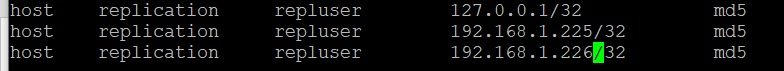

><u>Рестартуем оба сервера</u>

><u>На всяк случай создадим копию папки ***data*** на SLAVE, остановив предварительно сервер. в данном примере мы сохраним все содержимое каталога ***/var/lib/pgpro/std-15/data*** в виде архива ***/tmp/data_pgsql.tar.gz***.</u>

><u>Удаляем содержимое каталога с данными SLAVE и убедимся, что каталог пуст</u>

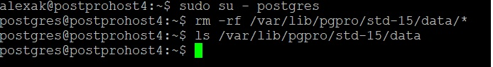

><u>Выполняем команду для запуска репликации. Вводим пароль для ***repluser***</u>

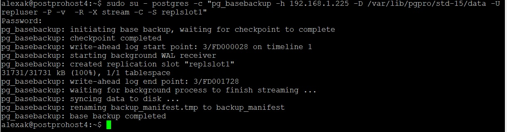

><u>
где:
192.168.1.225 — IP-адрес мастера; 

/var/lib/pgpro/std-15/data/ — путь до каталога с данными.

h - указывает хост, который является MASTER сервером.

-D - указывает каталог данных.

-U - указывает пользователя подключения.

-P - включает отчет о прогрессе.

-v - включает подробный режим.

-R - включает создание конфигурации восстановления: создает файл standby.signal, добавляет параметры подключения к postgresql.auto.conf в каталоге данных.

-X - используется для включения необходимых файлов журнала упреждающей записи (файлов WAL) в резервную копию.

Значение stream означает потоковую передачу WAL во время создания резервной копии.

-C - позволяет создать слот репликации, названный параметром -S, перед запуском резервного копирования.

-S - указывает имя слота репликации.
</u>

><u>Стартуем сервер на SLAVE</u>

><u>Убедимся, что репликация работает и системы синхронизированы. LSN-ы отправителя равны получателю. Все ОК репликация работает в синхронном режиме.</u>

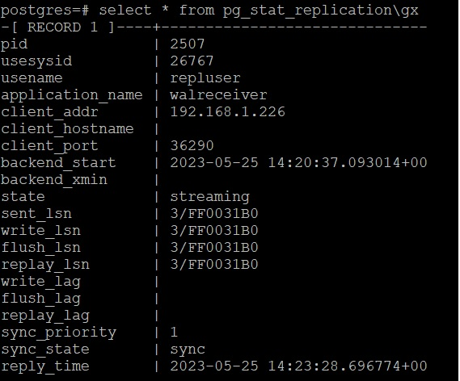

><u>Создадим базу и таблицу на MASTER, и поместим в нее значение.</u>

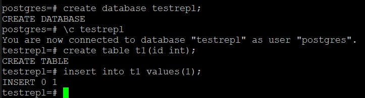

><u>Идем на SLAVE и убеждаемся, что изменения пришли.</u>

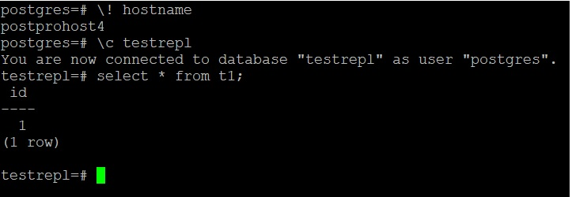

><u>Первый раздел завершен. Все ОК</u>

# Логическая репликация

><u>В файле postgresql.auto.conf сменить значение параметра wal_level на обеих серверах и рестартовать сервисы</u>

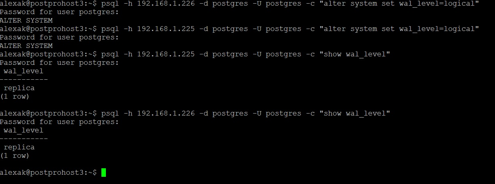

><u>В файле pg_hba.conf на сервере издателе добавляем строку с IP адресом подчиненного сервера и рестартуем службу</u>

><u>На обоих хостах создать базу, таблицу и положить данные на мастер</u>

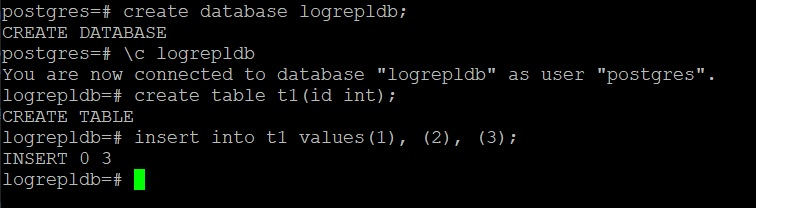

><u>На мастере создать публикацию и добавить туда таблицу ***t1***</u>

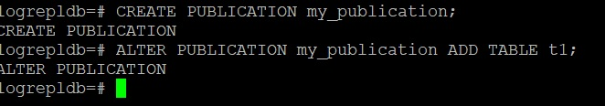

><u>На подписчике создать  подписку и проверить что все строки пришли</u>

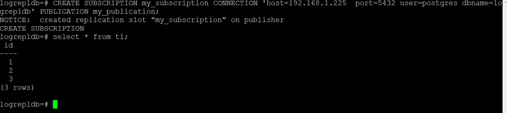

><u>Добавим еще стор на мастера</u>

><u>Проверим. Все ОК</u>

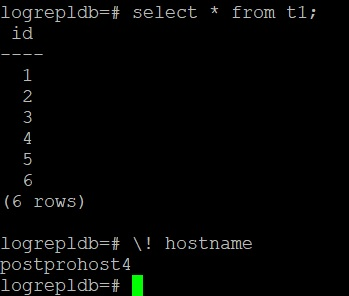

><u>ДЗ завершил.</u>