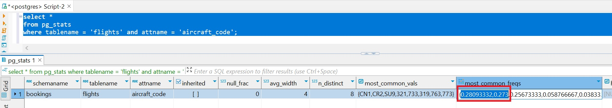
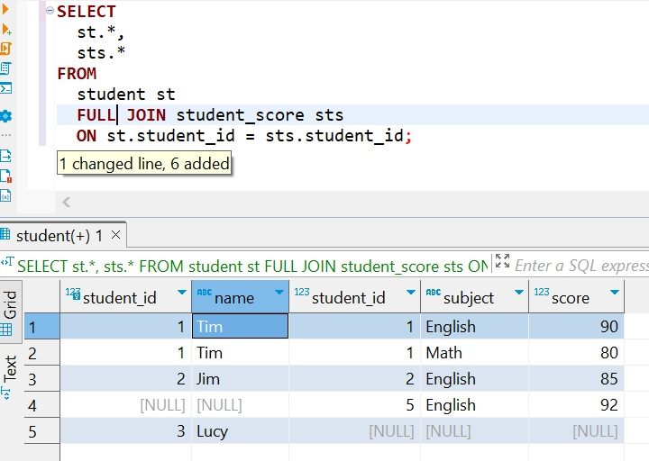

# Вариант 1

## Обычные индексы
 
 
><u>Используем демо базу ***bokking*** бронирования белетов</u>

><u>Используем таблицу ***flights***</u>

><u>Оптимизатор предполагает, что в таблице ***flights*** по данному условию размещено 18447 строк. ОРткуда он знает?</u>

<u> Данный критерий поиска является наиболее характерным для данного столбца данной таблицы</u>

<u>Умножив 0.28093332 (частоту встречаемости) на 65664 (количество строк в таблице) получим 18 447. И как можно заметить оптимизатор сильно не ошибся</u>

<u>Но поскольку на столбце нет индекса оптимизатор будеи сканировать таблицу и применять к ней фильтр/u>

<u>Построим индекс (***create index flights_aircraft_code on bookings.flights(aircraft_code)***) и выполним запрос еще раз</u>
><u>На шаге 1 использхованием индекса были выбраны страницы, на которых размещены искомые данные</u>

><u>На шаге 2 построена битовая маска где каждый бит соответсвует странице с данными</u>

><u>На шаге 3 выбраны интересующие нас строки и возвращены клиенту.</u>

## Полнотекстовые индексы

><u>Создадим тестовую базу для полнотекстового поиска и насыпим туда данных.</u>

><u>Убедимся, что поис работает хотя пока без индекса.</u>

><u>Добавим столбец в таблицу и построим индекс.</u>

><u>Добавим данные в созданный столбец.</u>

><u>Обратите вниманиеЮ что поиск происходит по словоформам. Мы искали ***break***, а найдено ***breaking*** </u>

><u>Более сложный поиск </u>

## Индекс на части данных.

><u>Предположим, что мы работаем в аэропорту города Усинск и нас интересуют только данные по вылетам из этого аэропорта. Создаем индекс.</u>

><u>Как видим индекс используется.</u>

><u>Создадим индекс по двум столбцам</u>

><u>Здесь классика жанра. Поиск по дереву индекса->составление битмапов страниц->выборка строк из битмапленных страниц.</u>

><u>Изменим результирующий набор. И этап битмапов исчез. В данном случае мы имеем Индекс покрывающий запрос и все данные есть в дереве индекса, а поэтому обращение к старницам данных не нужно.</u>

# Вариант 2

***Написания запросов с различными типами соединений***
 
 
><u>Создадим тестовую базу, а также объекты в ней, и насыпим туда немного данных</u>

## Реализовать прямое соединение двух или более таблиц

><u>В результат входят только строки соответствующие равенству в операторе ***ON***</u>

## Реализовать левостороннее (или правостороннее) соединение двух или более таблиц
<u>Студентка Lucy не здавала ни одно экзамена, поэтому на месте экзаменов ***NULL***</u>

<u>А был студент, под ***ID=5*** который сдавал экзамен, а потом его выгнали (шутка), поэтому на месте данных о студенте из таблицы ***students*** стоит ***NULL***</u>

# Реализовать полное соединение двух или более таблиц

<u>А тут все. Тут и Lucy, которая сачконула экзамен, и студент, которого выперли из вуза.</u>

# Реализовать кросс соединение двух или более таблиц

<u>А тут все варианты студентов и экзаменов. Это Декартово (безусловное) произведение двух множеств.</u>

# Самосоединение двух или более таблиц

<u>Найти имена студентов сдававших одинаковые экзамены.</u>

><u>ДЗ завершил. Ура.</u>