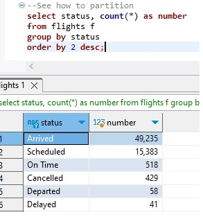
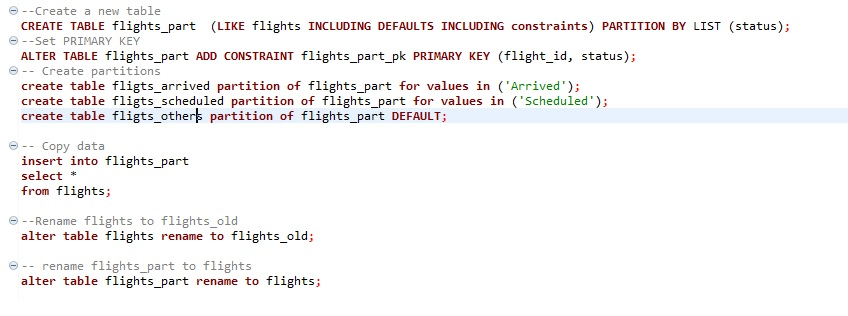
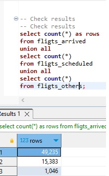

# Partitioning tables
 
 

><u>Используем демо базу ***demo*** бронирования белетов</u>

><u>Таблица ***flights***. Посчитаем распределение столбца ***status***</u>

><u>Три раздела ***Arrived***, ***Scheduled***, ***Others***</u>>

><u>Выполняем работы</u>

><u>Проверяем резултат</u>

><u>Или так</u>

><u>ДЗ завершил. Ура.</u>